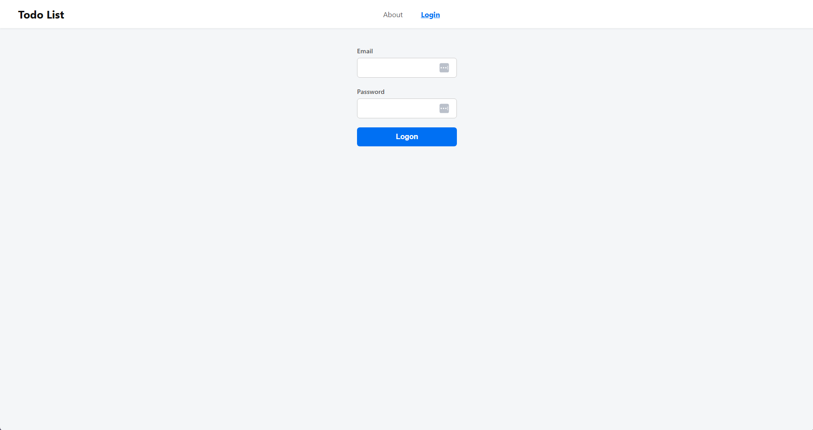
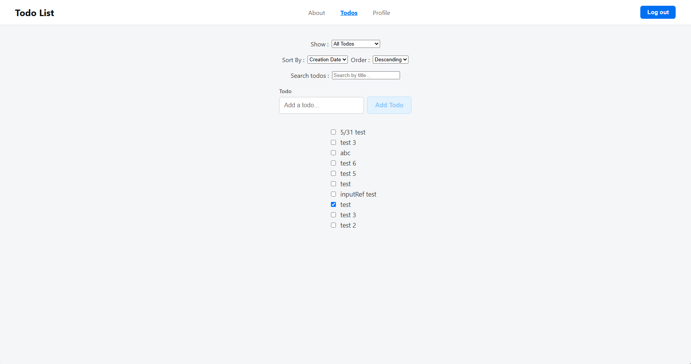
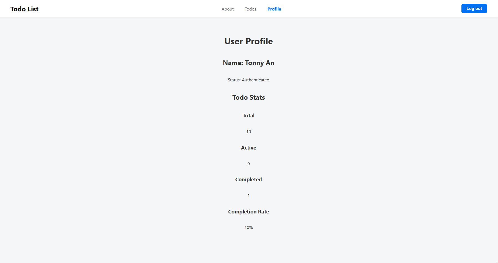
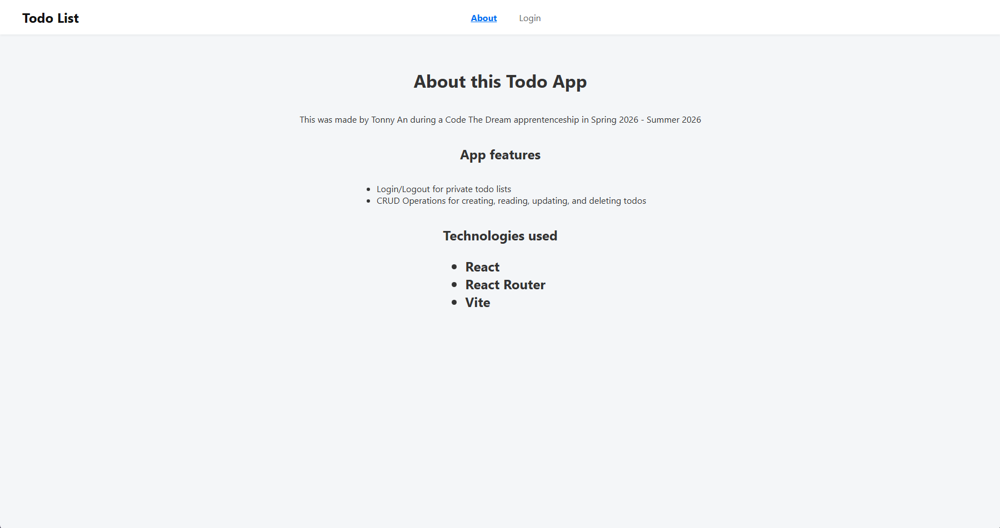

# TODO List Manager

A TODO management application built with React that allows users, through authenticated and protected routes, to manage their TODOs by sorting, filtering, and updating. 

## 🌟 Features

### 🔐 Authentication



* Secure login and logout functionality
* Protected routes using React Router
* Authentication state managed with React Context
* CSRF token support for API requests

### 📝 Todo Management



* Create new todos
* Edit existing todos
* Mark todos as completed
* View active and completed todos
* Optimistic UI updates for a responsive user experience

### 🔍 Search & Sorting & Filtering

* Search for todos by name
* Debounced search input for improved performance
* Sort todos by creation date or by name in descending or ascending order
* Filter todos by status:

  * All todos
  * Active todos
  * Completed todos

### 📊 User Dashboard



* User profile page
* Todo statistics
* Total Todo
* Completed Todo
* Active Todo

### ✨ User Experience

* Loading states
* Error handling
* Responsive navigation
* Custom reusable React hooks
* Centralized state management using `useReducer`

---

## 🛠️ Technologies used

### Frontend

* React 19
* React Router
* Vite
* JavaScript (ES6+)

### State Management

* React Context API
* useReducer
* Custom Hooks

### API Integration

* Fetch API
* Authentication endpoints
* CRUD task endpoints

---

## 📂 Project Structure

```text
src/
├── components/
│   └── RequireAuth.jsx
│
├── contexts/
│   └── AuthContext.jsx
│
├── features/
│   ├── Logon.jsx
│   ├── LogOff.jsx
│   └── todos/
│       ├── TodoForm.jsx
│       └── todoList/
│           ├── TodoList.jsx    
│           └── TodoListItem.jsx
│
├── hooks/
│   └── useEditableTitle.js
│
├── pages/
│   ├── HomePage.jsx
│   ├── LoginPage.jsx
│   ├── TodosPage.jsx
│   ├── ProfilePage.jsx
│   ├── AboutPage.jsx
│   └── NotFoundPage.jsx
│
├── reducers/
│   └── todoReducer.js
│
├── shared/
│   ├── Header.jsx
│   ├── Navigation.jsx
│   ├── FilterInput.jsx
│   ├── StatusFilter.jsx
│   └── SortBy.jsx
│
├── utils/
│   ├── todoValidation.js
│   └── useDebounce.js
│
├── App.jsx
└── main.jsx
```

---

## 🚀 Installation

### Clone the repository

```bash
git clone https://github.com/InTheHeezy/todo-list.git
```

### Navigate to the project

```bash
cd todo-list
```

### Install dependencies

```bash
npm install
```

### Configure Environment Variables

Create a `.env` file using the provided `.env.example`.

```bash
cp .env.example .env
```

### Start the development server

```bash
npm run dev
```

Open your browser and navigate to:

```text
http://localhost:3001
```

---

## 🎓 Learning Objectives

This project demonstrates:

* React Component Architecture
* React Router Protected Routes
* Context API Authentication
* Reducer-Based State Management
* Custom Hooks
* Debounced Search
* API Integration
* Optimistic Updates
* Error Handling
* Modern React Development Practices

---


## ✍️ Author



Tonny An

💻 GitHub: https://github.com/InTheHeezy

👔 LinkedIn: https://www.linkedin.com/in/tonny-an-444458293/

---

